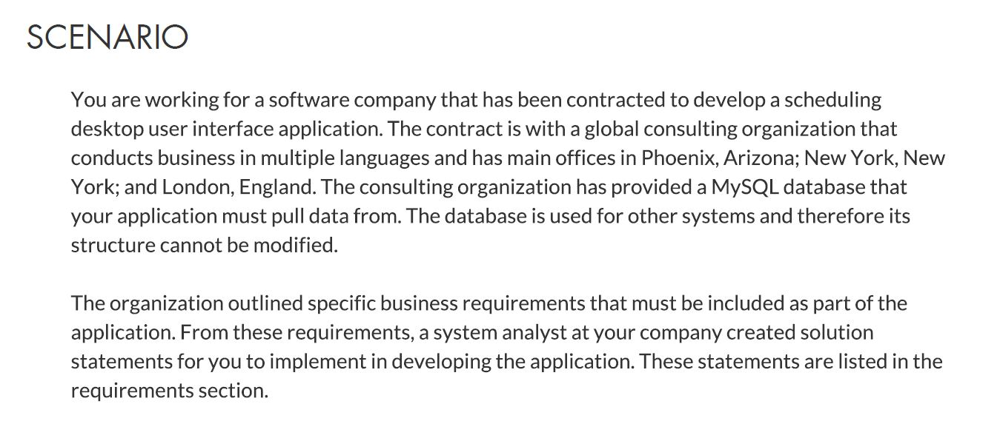
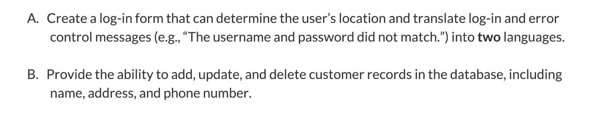
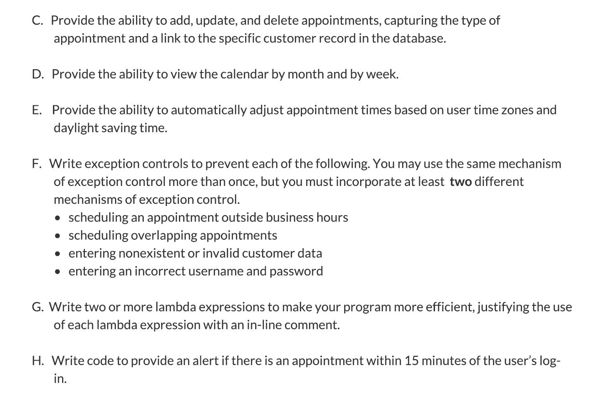
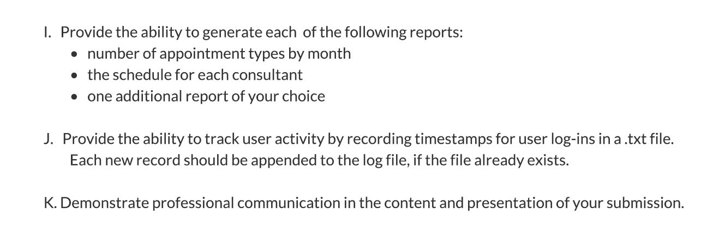

# DesktopSchedulingSystem
An application for scheduling appointments complete with database functionality. This was my second project for WGu written in Java.

-----------------------------------------------------------------SCENARIO-------------------------------------------------------------------

---------------------------------------------------------------REQUIREMENTS-----------------------------------------------------------------

------------------------------------------------------------------PROGRAM--------------------------------------------------------------------

