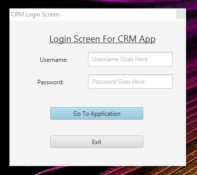
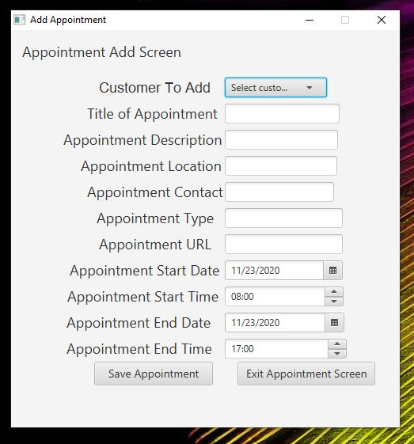
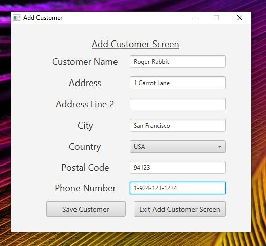
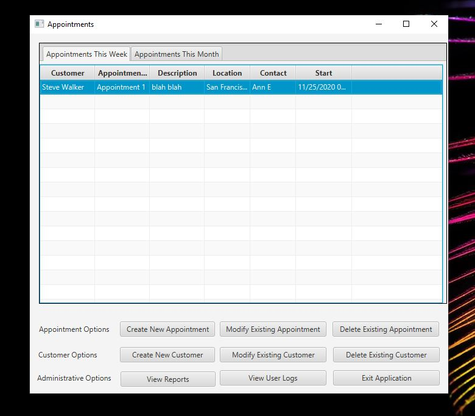
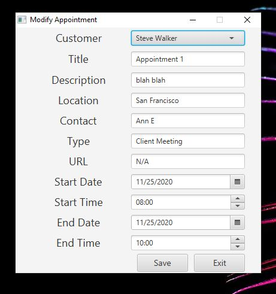
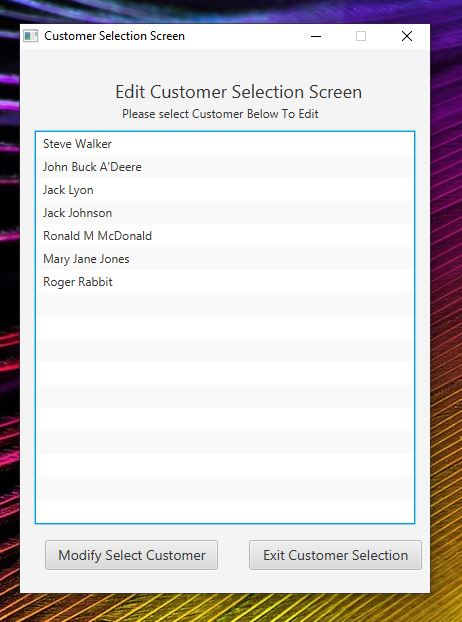
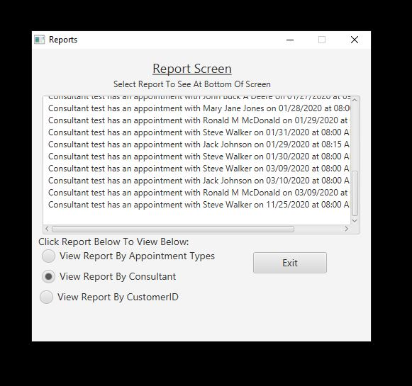

# DesktopSchedulingSystem
An application for scheduling appointments complete with database functionality. This was my second project for WGU written in Java.

---------------------------------------------------SCENARIO---------------------------------------------------

------------------------------------------------REQUIREMENTS--------------------------------------------------

------------------------------------------------PROGRAM--------------------------------------------------------

Login Screen

Add Appointment

Add Customer

Appointment List

Modify Appointment

Modify Customer

Report Screen

